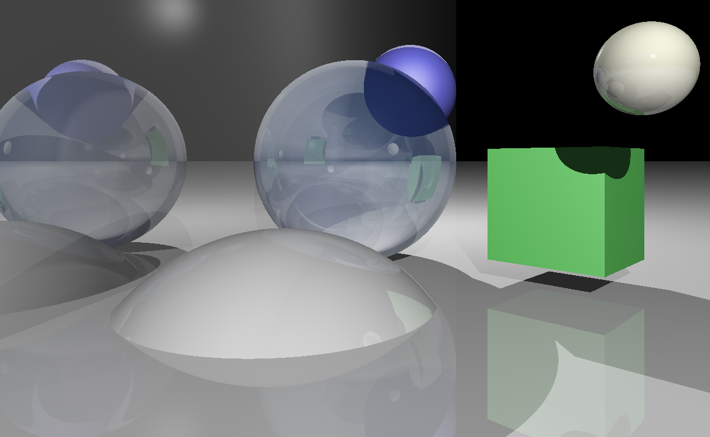

# Ray Tracer

As the last first-year project of my engineer studies, I designed and developed with a small team
of three persons a Java application able to render 2D-images from a 3D-scene using ray tracing.
During four weeks, I was being in charge of the team and the management of the project. After
about one week of analysis, we designed and validated a model, established working scenarios and
defined achievements. Then, we tried at most to go through a test-driven-development approach
and finally achieved all goals that were decided. Some parts of the project may look quite messy and
some other parts should definitly be refactored ; Nevertheless, it was such a challenge to develop,
test and build the RayTracer in only a four-week period.

## How it works?
* The application computes 2D images from viewpoints inside a 3D scene using ray tracing
according to the Blinn-Phong model 1.
* A scene is composed of basic elements such as spheres, cubes and 2D plans.
* For each image, the RayTracer computes four different light components (ambient, diffuse,
specular and refracted & reflected)
* User has possibility to manage the scene and his elements through a Graphical User Interface.
* Images could be exported as .ppm files easily readable by a linux os

## What does it rely on?
* The application is built with Java 7 and his common libraries.
* It is built according to the mvc pattern in which model and controller communicate via an
Observee/Observer pattern.
* The graphical interface relies on the Swing 2 framework.
* All classes of the model have been tested using the JUnit 3 framework.
